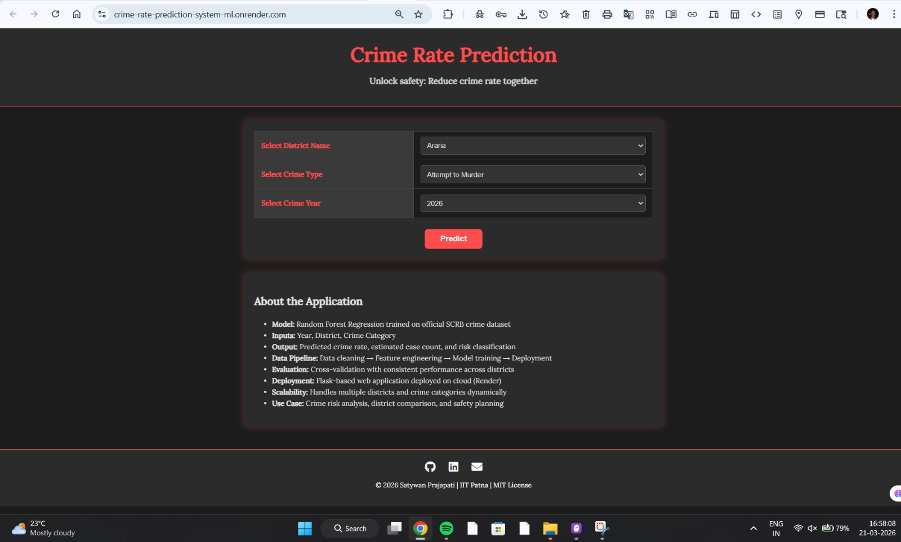
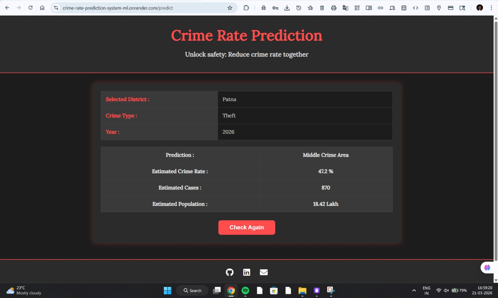

# Crime Rate Prediction System

A Machine Learning-based web application that predicts crime rate, estimated cases, and risk level across multiple districts using historical SCRB data.

---

## Live Demo
https://crime-rate-prediction-system-ml.onrender.com

---

## Application Screenshots

### 🔹 Input Page

  

### 🔹 Output / Prediction Result

  

---

##   Key Features
- 🔹 Predicts crime rate using Machine Learning  
- 🔹 Provides estimated number of cases and population  
- 🔹 Displays risk level (Low / Medium / High)  
- 🔹 Supports multiple districts and crime categories  
- 🔹 Clean and responsive user interface  
- 🔹 Built using real-world SCRB dataset  

---

##  Tech Stack
- **Frontend:** HTML, CSS, JavaScript  
- **Backend:** Flask (Python)  
- **Machine Learning:** Random Forest Regression  
- **Deployment:** Render  

---

## How It Works
1. User selects Year, District, and Crime Type  
2. Input data is processed and encoded  
3. Trained ML model generates predictions  
4. Output includes:
   - Estimated Crime Rate (%)  
   - Estimated Cases  
   - Risk Level  

---

## Model Details
- Algorithm: Random Forest Regression  
- Dataset: SCRB Crime Data  
- Features: Year, District, Crime Category  
- Evaluation: Cross-validation with consistent performance  

---

## Project Structure

Crime_Rate_Prediction/
│── static/
│── templates/
│── assets/
│── model/
│── dataset/
│── app.py
│── requirements.txt
│── README.md

---

## Use Cases
- Crime risk analysis  
- District-level comparison  
- Safety planning  
- Data-driven insights and many more 

---

## Author
**Satywan Prajapati**  
IIT Patna | Data Science Enthusiast  

---

## ⭐ Support
If you found this project useful, consider giving it a ⭐ on GitHub.